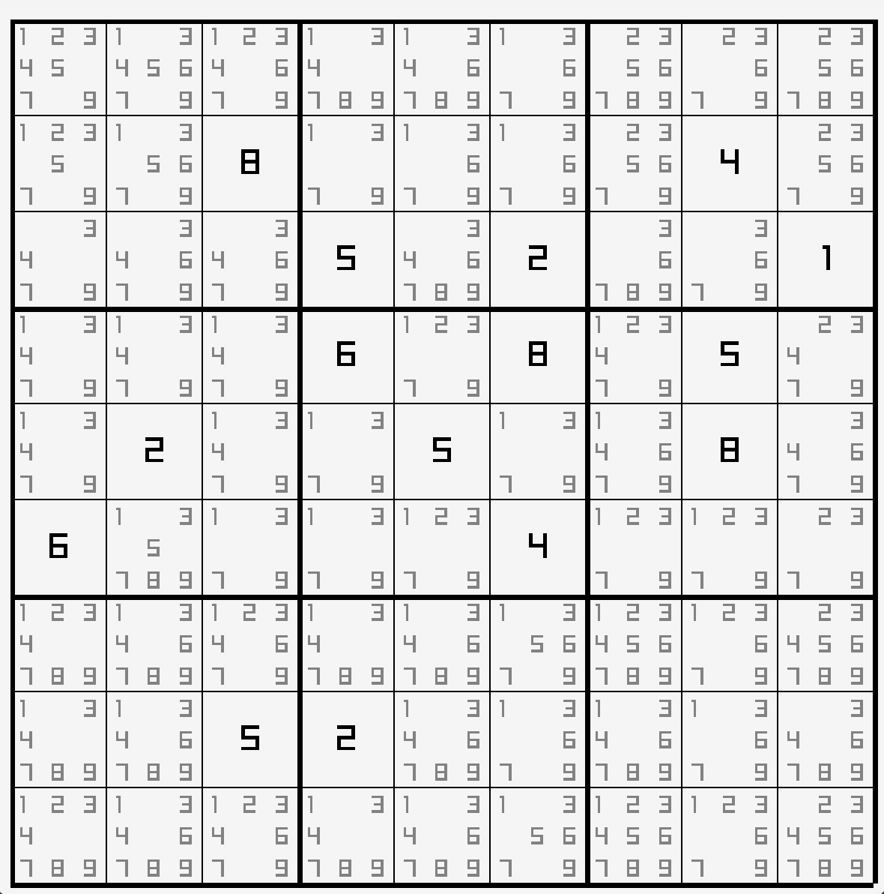

# Sudoku Wave Function Collapse

A visual demonstration of the wave function collapse algorithm applied to a Sudoku board.

## Usage

Requires:
- `clang` or another C compiler (change the `CC` variable in the `Makefile` if necessary)
- `make`

Clone the repository recursively to include the submodules.

```bash
# Pre git 2.13
$ git clone --recursive

# Post git 2.13
$ git clone --recurse-submodules
```

Use `make` to build and run the program.

```bash
$ make run
```

Keys:
- `R` - Reset the board
- `Z` - Undo the last action (only 1 level of undo)


